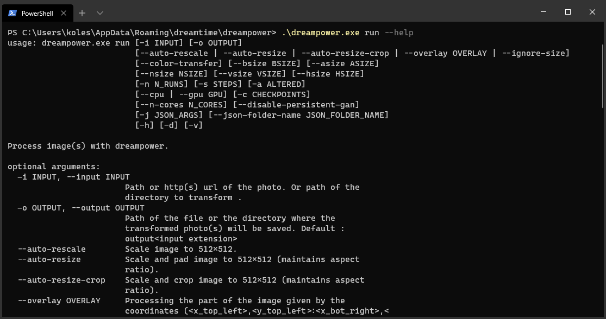

<p align="center"></p>
<h1 align="center">DreamPower</h1>
<p align="center">
  Available for <strong>Windows, Linux and Mac</strong>.
</p>

<p align="center">
  <a href="https://github.com/opendreamnet/dreampower/releases">
    
  </a>
</p>

<p align="center">
  <a target="_blank" href="https://codeclimate.com/github/private-dreamnet/dreampower/maintainability">
    
  </a>
  
  <a href="CONTRIBUTING.md#pull-requests">
    
  </a>
</p>

## ⚠️ Project discontinued.

Thank you for your interest in DreamPower. Unfortunately we have discontinued the project and will focus our efforts on other projects, if you are interested in a better nudification algorithm that can be used from any device visit our new project:

https://www.sukebezone.com/

We have taken the decision to archive the repository since no PR has been received for more than 1 year.

## About

DreamPower is a fork of the [DeepNude algorithm](https://github.com/stacklikemind/deepnude_official) that generates better fake nudes and puts at your disposal a command line interface.

It consists of several algorithms that together create a fake nude from a photo.

> If you don't have experience using command line applications you can download [DreamTime](https://dreamtime.tech) which offers you a friendly user interface.



## Features

|                        | DreamPower | DeepNude |
| ---------------------- | ---------- | -------- |
| Multiplatform          | ✔️          | ❌        |
| Command-line interface | ✔️          | ❌        |
| NVIDIA GPU Support     | ✔️          | ❌        |
| Multithreading         | ✔️          | ❌        |
| Automatic Scale        | ✔️          | ❌        |
| GIF Support            | ✔️          | ❌        |
| Video Support          | ✔️          | ❌        |
| Body Customization     | ✔️          | ❌        |
| Daemon                 | ✔️          | ❌        |
| Custom Masks           | ✔️          | ❌        |
| Active Development     | ✔️          | ❌        |

## Requirements

- 64 bits operating system:
  - Windows 7 or superior.
  - Ubuntu 16.04+
  - macOS Catalina or superior.
- **12 GB** of RAM.

### GPU (Optional)

- **NVIDIA GPU** (AMD GPU's are not supported)
- Minimum [3.5 CUDA compute capability](https://developer.nvidia.com/cuda-gpus). (GeForce GTX 780+)
- [Latest NVIDIA drivers](https://www.nvidia.com/Download/index.aspx).
- **6 GB** of GPU VRAM.
- **8 GB** of RAM.

## Usage

In the command line terminal run:

```
dreampower run --help
```

This will print out help on the parameters the algorithm accepts.

> **The input image should be 512px * 512px in size** (parameters are provided to auto resize/scale your input).

---

# How does DreamPower work?

DreamPower uses an interesting method to solve a typical AI problem, so it could be useful for researchers and developers working in other fields such as *fashion*, *cinema* and *visual effects*.

The algorithm uses a slightly modified version of the [pix2pixHD](https://github.com/NVIDIA/pix2pixHD) GAN architecture. If you are interested in the details of the network you can study this amazing project provided by NVIDIA.

A GAN network can be trained using both **paired** and **unpaired** dataset. Paired datasets get better results and are the only choice if you want to get photorealistic results, but there are cases in which these datasets do not exist and they are impossible to create. A database in which a person appears both naked and dressed, in the same position, is extremely difficult to achieve, if not impossible.

We overcome the problem using a *divide-et-impera* approach. Instead of relying on a single network, we divided the problem into 3 simpler sub-problems:

- 1. Generation of a mask that selects clothes
- 2. Generation of a abstract representation of anatomical attributes
- 3. Generation of the fake nude photo

## Original problem:


## Divide-et-impera problem:


This approach makes the construction of the sub-datasets accessible and feasible. Web scrapers can download thousands of images from the web, dressed and nude, and through photoshop you can apply the appropriate masks and details to build the dataset that solve a particular sub problem. Working on stylized and abstract graphic fields the construction of these datasets becomes a mere problem of hours working on photoshop to mask photos and apply geometric elements. Although it is possible to use some automations, the creation of these datasets still require great and repetitive manual effort.

## Computer Vision Optimization

To optimize the result, simple computer vision transformations are performed before each GAN phase, using OpenCV. The nature and meaning of these transformations are not very important, and have been discovered after numerous trial and error attempts.

Considering these additional transformations, the phases of the algorithm are the following:

- **dress -> correct** [OPENCV]
- **correct -> mask** [GAN]
- **mask -> maskref** [OPENCV]
- **maskref -> maskdet** [GAN]
- **maskdet -> maskfin** [OPENCV]
- **maskfin -> nude** [GAN]


